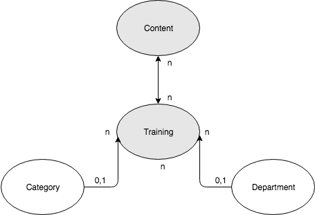

    

# Table of Contents

* [Technology](#technology)
* [Setup](#setup)
* [Building](#building)
* [Modeling](#modeling)

## Technology

### Frontend
- ReactJS
- Redux
- Material-UI. 

### Backend
- Django
- Django rest framework(DRF) 
- PostgreSQL. 

### Authentication
- Token authentication.

### Interaction
- REST based.

## Setup

### Postgres setup for MAC:

- `brew install postgres`
- `psql postgres`
- `create role admin with login password '1234';`
- `\q`
- `psql postgres -U admin`
- `create database training;`
- `GRANT ALL PRIVILEGES ON DATABASE training TO admin;`

### Backend setup:

- Go to backend folder *lets_train_backend*
- virtualenv venv
- source venv/bin/activate
- pip install -r requirements.txt
- python manage.py makemigrations
- python manage.py migrate
- python manage.py runserver

### Frontend setup:

- Go to frontend folder *lets_train_ui*
- npm install
- npm start

### Creating an admin user for application:

- Comment authentication in *lets_train_backend/api_app/views.py*
  - `	# authentication_classes = (TokenAuthentication,)`
  - `	# permission_classes = (IsAdminOrReadOnly, )`
- **URL**: *localhost:8000/api/user/*
- **Method**: POST
- **JSON**:
   [{

        "username":"1234",

        "first_name":"admin",

        "last_name":"",

        "email":"admin@localhost.com",

        "password":"1234",

        "userprofile":{
            "employee_code":"00000"
         },

        "is_staff": true

  }]
- This will create an admin user with username **1234** and password **1234**
- Uncomment authentication in *lets_train_backend/api_app/views.py*

## Building:

### Start Django backend:
- Go to backend folder *lets_train_backend*
- source venv/bin/activate
- python manage.py runserver

### Start React frontend:
- Go to frontend folder *lets_train_ui*
- npm start

### Access admin view:

- *Go to localhost:3000/admin/ on your browser.*

### Access employee view:

- *Go to localhost:3000/ on your browser.*

## Modeling:

    

- **Categories** are used to classify the **Trainings**.
- **Departments** are the divisions made by the organisation.
- **Training** can have a **Category**.
- **Training** can have a **Department**.
- **Training** can have multiple **Contents**.
- **Content** can be a part of multiple **Trainings**.

